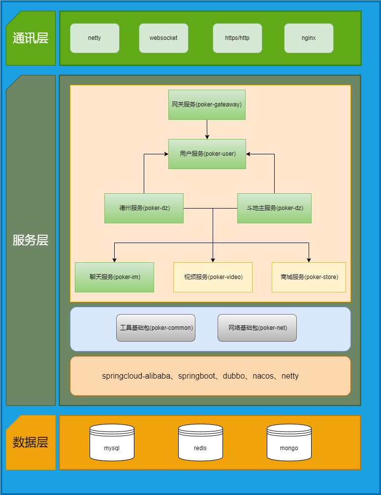

# poker
扑克-分布式微服务架构，包含网关服务、用户服务、德州扑克服务、斗地主服务、IM服务、视频服务。
## 技术栈
- java
- springcloud-alibaba、springboot、dubbo、spring-webflu、netty、websocket、protobuf
- mybatis、mybatis-plus
- mysql、redis、mongo

## 架构概述

该项目采用分层架构，主要包括以下组件：

1. 通讯层: 使用dubbo处理服务之间的远程调用,负载均衡, 使用netty处理与客户端protobuf协议的通信。  
2. 服务层: 利用mybatis-plus实现对数据库的访问,使用nacos服务发现和配置管理,使用spring-webflux处理Web登录请求。  
3. 数据库层: 使用mysql实现关系型存储,使用redis实现非关系型缓存,使用mongo实现非关系型存储。  

### 系统架构图
#### 应用架构图

#### 业务架构图

### 模块说明
1、poker-common: 基础公共包  
2、poker-dz: 德州扑克服务  
3、poker-gateway web登录认证服务  
4、poker-im 聊天服务  
5、poker-net 网络通信、协议分发模块  
6、poker-rpc-api 内部服务远程调用公共接口模块  
7、poker-user 用户信息服务  
8、poker-video 视频服务  

### 依赖关系
poker-net 依赖poker-common提供工具类。  
poker-dz 德州扑克服务依赖poker-net提供网络协议通讯。  
poker-im 聊天服务依赖poker-net提供网络协议通讯。   
poker-video 视频服务依赖poker-net提供网络协议通讯。  
poker-user依赖poker-rpc-api给需要用户服务的服务提供服务。  
poker-gateway依赖poker-user获取用户信息作认证。  

## 安装和运行
linux:  
1. 安装jdk1.8以上版本    
2. 安装nacos-server-2.2.3    
3. 修改各服务resource/application.yml配置  
3. ./start.sh  

## 配置

## 使用示例

## 贡献

## 文档
[protobuf编译成ts](https://www.npmjs.com/package/pbjs)  
1.pbjs D:\coding\poker-client\assets\scripts\proto\EnterRoomRequest.proto --ts D:\coding\poker-client\assets\EnterRoomRequest.ts  

## 许可证

## 联系方式
如有任何问题，请发送邮件至 [你的邮箱](zcg1011713962@163.com)。